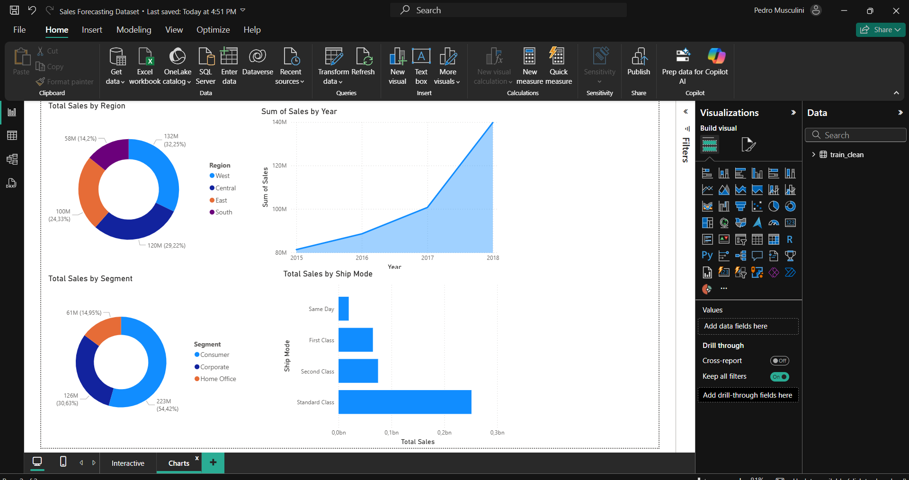
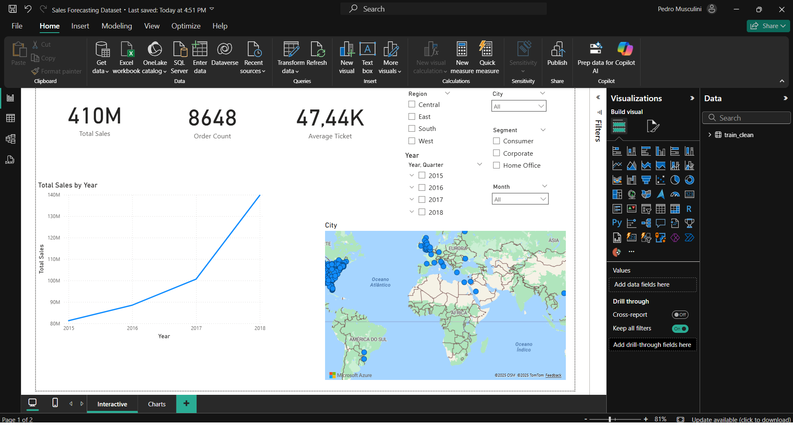

# Superstore BI Dashboard


This repository contains a complete Business Intelligence solution using Power BI and Python for data preparation and analysis.

## Contents
- `Sales Forecasting Dataset.pbix`: Power BI dashboard file with interactive KPIs, slicers, and visualizations.
- `task1/runfirst.py`: Python script for data cleaning, exploratory analysis, and exporting clean data.
- `train.csv`: Raw data file (Superstore dataset).
- `train_clean.csv`: Cleaned data file generated by the Python script.
- `superstore.db`: SQLite database with the cleaned data.

## Features
- Data cleaning and outlier removal using Python (Streamlit interface).
- Exploratory Data Analysis (EDA) with descriptive statistics and visualizations (histogram, bar chart).
- Export of cleaned data to CSV and SQLite database.
- Power BI dashboard with:
  - KPIs: Total Sales, YoY Growth, Current Month Sales, Average Ticket, Order Count
  - Interactive slicers: Region, Year, Quarter, Month, City, Segment
  - Line chart for monthly sales trends
  - Bar chart for sales by region
  - Map visualization for geographic sales distribution
  - Reset button to clear all filters and slicers

## How to Use
1. Clone this repository.
2. Run `task1/runfirst.py` with Streamlit to clean and explore the data:
   ```bash
   streamlit run task1/runfirst.py
   ```
3. Open `Sales Forecasting Dataset.pbix` in Power BI Desktop to explore the dashboard.

## Skills Demonstrated
- Data preparation and cleaning in Python
- SQL queries for aggregation
- Visual analytics and dashboard design in Power BI
- Interactive BI features (slicers, reset button, map)

## Contributing
Contributions are welcome! To contribute:
1. Fork this repository
2. Create a new branch (`git checkout -b feature-nome`)
3. Commit your changes
4. Open a Pull Request

## Screenshots



## Author
Pedro Musculini

---
Feel free to use, share, or improve this project!
